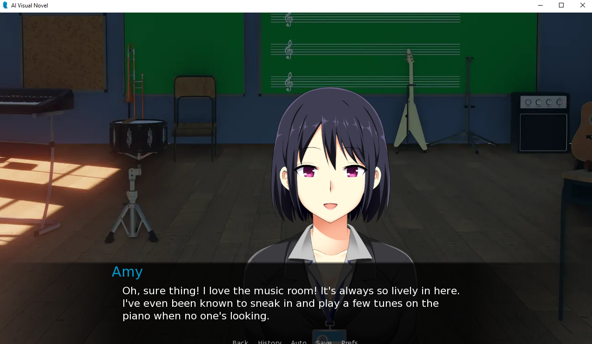
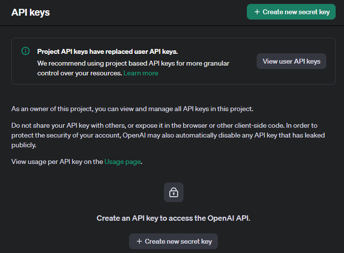

A basic AI visual novel template.

**Features:**
- Generated replies
- Local Language models
- Optional usage of paid APIs such as openai and groq
- Default background images
- Generated backgrounds (using getimgai but u can contribute another api for this too)
- Easily add new characters

**How to add your own sprites**

If you want to add your own sprites & your own default backgrounds, it's very simple.

<a href="TUTORIAL.md"> Follow this guide</a>

# Examples

**Note:** The backgrounds here are not AI generated.

# AI Setup

## Ollama

Ollama makes setting up a local chat model really simple. All you have to do is download it and run `ollama pull llama3` in a console and you're done.

**Let's Start!**
- Go to https://ollama.com/download
- Select the Operating system you're using (For example Windows)
- Click on Download

Once it's downloaded, run the application.

If you're on windows you should see a small icon in your taskbar that looks like a llama. That means it's running.

- Open up a console on your device (eg. cmd+r if you're using windows, then type "cmd" and press enter)
- In the terminal type "ollama pull llama3" (or any model you find in https://ollama.com/library/)

By default this will be a 8 billion parameter model which means the quality will be lower. If your computer can handle it you can try downloading a 70 billion parameter model

# Chat API Setup (Optional)

## Groq

Groq let's you run a few open sourced models such as llama3-70b, mixtral, mistral etc. at amazing speeds.

**Let's Start!**

- Go to https://console.groq.com/login
- Sign up with whichever account you want
- Go to https://console.groq.com/keys
- Copy the key and make sure you save it somewhere

## Openai

OpenAI provides models such as gpt4o most notably that have great quality responses and consistency that a lot of open source and local models fail to match, especially considering the speed.

**Let's start!**

- Go to https://platform.openai.com/api-keys
- Login or Sign Up

The Page should look something like This

Click on "Create secret key"

You'll see a popup, leave everything on the default settings (you can optionally name the key if you want).

Copy the generated token and make sure to save it somewhere safe. Do not share it with anyone else. You can regenerate the key if you think it has been leaked.

# Image API Setup (Optional)

## Getimgai

In terms of quality images, getimgai isn't terrible but it can be lacking in terms of getting the image you actually want from my testing at least

**Let's start!**

- go to https://dashboard.getimg.ai/api-keys
- You'll likely be redirected to a login page, simply sign up and revist the link
- Create a key, copy it and save it somewhere safe.

# Credit (Assets)

Backgrounds: https://potat0master.itch.io/free-visual-novel-backgrounds-school-mini-pack-2

Male sprites: https://sutemo.itch.io/male-character-sprite-for-visual-novel

Female sprites: https://sutemo.itch.io/female-mature-anime-sprite